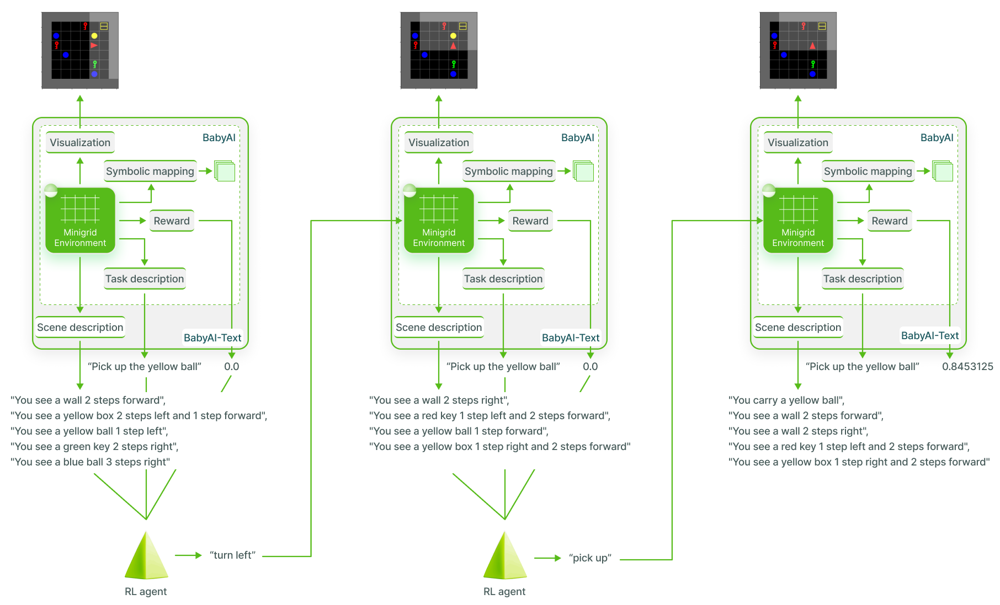

# BabyAI-Text
BabyAI-Text is a wrapper on top of BabyAI to make it a text-only environment returning a textual description of the agent's observation.


This is a cleaned up version of BabyAI-text from: https://github.com/flowersteam/Grounding_LLMs_with_online_RL/

## Installation
TODO


## New environment
TODO

```python
import gym
import babyai_text

env = gym.make("BabyAI_MixedTrainLocal")
```
